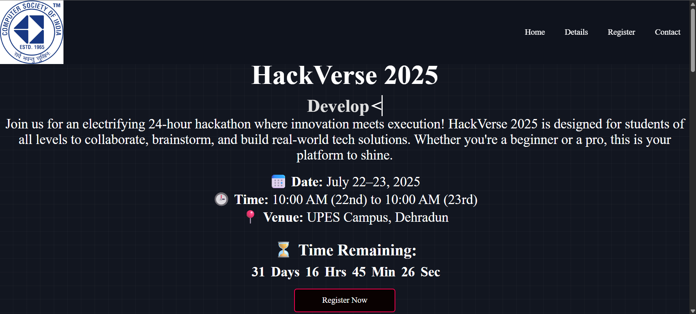
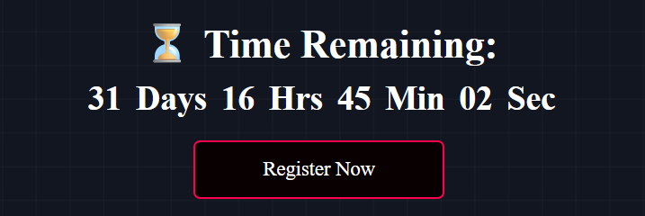
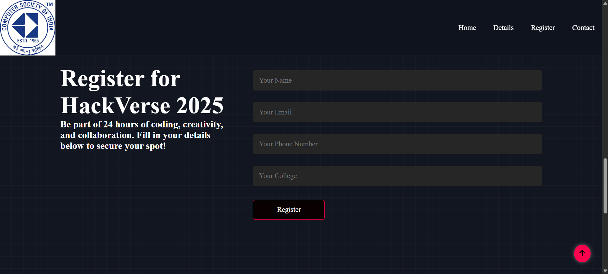
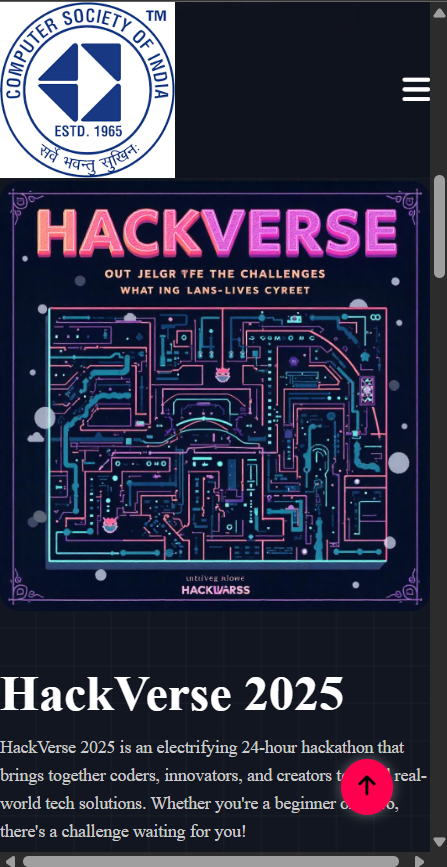
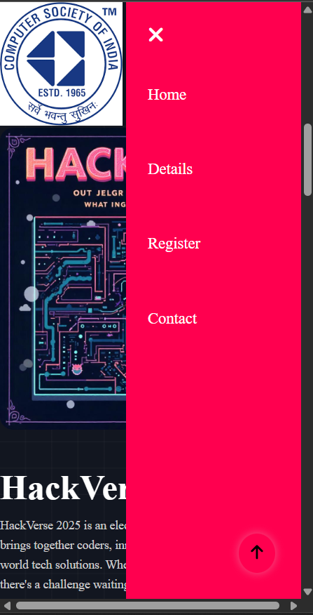

# HackVerse-2025-Website
A clean, responsive, and aesthetically designed web interface developed for HackVerse 2025. The website reflects modern design principles, ensuring visual appeal, consistency, accessibility, and seamless performance across various devices and screen sizes.

It features a fixed navigation bar for intuitive site navigation, an animated hero section to attract user attention, a real-time countdown timer to build anticipation, and a structured registration form for participant onboarding. The design follows modern UI/UX principles and emphasizes clarity, visual appeal, and performance. The site serves as the primary digital touchpoint for engaging potential participants and effectively communicating event information.

## 📊 Language Usage

- HTML: 40%
- CSS: 35%
- JavaScript: 25%

## ⚙️ Setup / Installation Instructions

To run the project locally, follow these steps:

1. **Clone the repository**
   ```bash
   git clone https://github.com/Narind1/HackVerse-2025-Website.git
2. **Navigate to the project directory**
  
         cd HackVerse-2025-Website
5. **Open the project in your browser**

   
        Locate the index.html file and open it directly, or use:
          start index.html   # Windows
          open index.html    # macOS
## 🔗 Live Demo

You can view the live version of the website here:  
👉 [HackVerse 2025 Website](https://hack-verse-2025-website.vercel.app/)

## 📸 Screenshots

### 🔹 Hero / Landing Section


### 🔹 Countdown Timer


### 🔹 Registration Form


### 🔹 Responsive View (Mobile)




## 🧩 Challenges Faced & Solutions

### 1. Overlapping Navigation Bar
- **Issue:** The fixed navbar overlapped the top content when scrolling or using anchor links.
- **Solution:** Applied `padding-top` to sections and used `scroll-padding-top` in the HTML element to offset the fixed nav height.

### 2. Responsive Design Adjustments
- **Issue:** The layout and text alignment broke on smaller screen sizes.
- **Solution:** Utilized Flexbox and relative units (`%`, `em`, `vh`) to ensure proper scaling, and tested across multiple device sizes.

### 3. Text Overflow in Hero Section
- **Issue:** Animated text and headings sometimes exceeded the container width.
- **Solution:** Used `white-space: nowrap`, overflow handling, and adjusted font sizes within media queries.

### 4. Countdown Timer Timing Issues
- **Issue:** Timer values were inconsistent due to timezone mismatches.
- **Solution:** Converted target times to local browser time using JavaScript `Date` objects to ensure consistency.

---

> Each of these challenges helped reinforce responsive design principles, layout debugging, and user-centered development.

## 🔗 Live Demo

You can view the live version of the website here:  
👉 [HackVerse 2025 Website](https://hack-verse-2025-website.vercel.app/)
